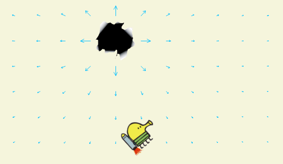

# Платформа: ulearn
## Курс: Основы программирования
### Тема: 19 Элементы функционального программирования
#### Практика «Лямбды и делегаты»
##### Решено 16 апреля 2023 в 16:21

В классе ForcesTask реализованы три вспомогательных метода, преобразующих одни делегаты в другие.

При запуске проекта Каракуля летает и управляться клавишами A и D.

Каракуля на ракете должен попасть в дыру, несмотря на все гравитационные аномалии

В классе LevelsTask добавлено в игру ещё несколько уровней.

В результате должны быть следующие уровни:
- Zero. Нулевая гравитация. Начальное положение ракеты и положение цели см. в коде. Если не указано иное, на других уровнях начальное положение цели и ракеты такое же.
- Heavy. Постоянная гравитация 0.9, направленная вниз.
- Up. Гравитация направлена вверх и значение её модуля вычисляется по формуле 300 / (d + 300.0), где d — это расстояние от нижнего края пространства. Цель должна иметь координаты (X:700, Y:500)
- WhiteHole. Гравитация направлена от цели. Модуль вектора гравитации вычисляется по формуле 140*d / (d²+1), где d — расстояние до цели.
- BlackHole. В середине отрезка, соединяющего начальное положение ракеты и цель, находится аномалия. Гравитация направлена к аномалии. Модуль вектора гравитации равен 300*d / (d²+1), где d — расстояние до аномалии.
- BlackAndWhite. Гравитация равна среднему арифметическому гравитаций на уровнях WhiteHole и BlackHole.

Все уровни удовлетворяют таким дополнительным условиям:
- Расстояние от начального положения ракеты до цели должно быть в пределах от 450 до 550.
- Угол между направлением на цель и начальным направлением ракеты должен быть не менее PI/4.

